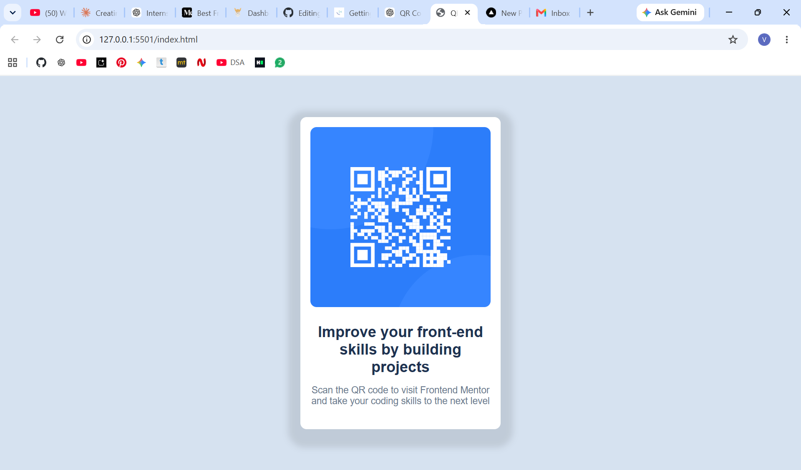

# Frontend Mentor - QR Code Component Solution

This is my solution to the [QR Code Component Challenge](https://www.frontendmentor.io/challenges/qr-code-component-iux_sIO_H) from Frontend Mentor.

Frontend Mentor challenges help developers improve their coding skills by building realistic and responsive projects.

## Table of Contents

- [Overview](#overview)
  - [Screenshot](#screenshot)
  - [Links](#links)
- [My Process](#my-process)
  - [Built With](#built-with)
  - [What I Learned](#what-i-learned)
  - [Continued Development](#continued-development)
  - [AI Collaboration](#ai-collaboration)
- [Author](#author)

## Overview

### Screenshot

### Links

- Solution URL: Add your GitHub repository link here
- Live Site URL: Add your deployed website link here

## My Process

### Built With

- Semantic HTML5 markup
- CSS3
- Flexbox
- Responsive Web Design
- Mobile-first workflow

## What I Learned

While building this project, I learned how to convert a design reference into a responsive webpage using HTML and CSS.

Some key concepts I practiced:

- Creating a structured webpage using semantic HTML elements
- Understanding the relationship between HTML structure and CSS styling
- Using Flexbox to center elements both vertically and horizontally
- Creating card layouts using padding, border-radius, and box-shadow
- Working with image sizing and spacing
- Improving my ability to match a design accurately using CSS

## Continued Development

In future projects, I want to continue improving my skills in:

- Responsive layouts for different screen sizes
- Advanced CSS concepts
- Building more interactive user interfaces
- Learning JavaScript and modern frontend frameworks like React

## AI Collaboration

I used ChatGPT as a learning assistant while developing this project.

I used AI for:

- Understanding the HTML structure required for the component
- Learning CSS concepts and layout techniques
- Debugging issues during development
- Getting explanations about design decisions and best practices

The purpose of using AI was to understand the concepts and improve my development skills.

## Author

- GitHub - VaishnaviLalan106
- LinkedIn - Add your LinkedIn profile link
- Frontend Mentor - Add your Frontend Mentor profile link
